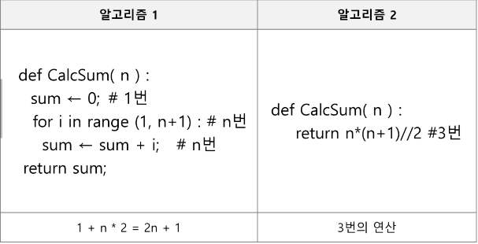
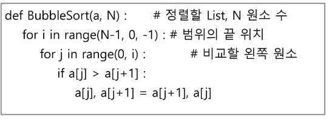

# 알고리즘
- 유한한 단계를 통해 **문제를 해결하기 위한 절차나 방법**

### 컴퓨터 분야에서 알고리즘을 표현하는 방법
1. 의사코드(슈도코드, Pseudocode)
2. 순서도

### 무엇이 좋은 알고리즘인가?
1. 정확성
2. 작업량
3. 메모리 사용량
4. 단순성
5. 최적성

### 시간 복잡도(Time Complexity)
- 실제 걸리는 시간을 측정
- 실행되는 명령문의 개수를 계산




# 배열
- 일정한 자료형의 변수들을 하나의 이름으로 **열거**하여 사용하는 자료구조

### 배열의 필요성
- 프로그램 내에서 여러개의 변수가 필요할 때, 일일이 다른 변수명을 이용하여 자료에 접근하는 것은 매우 비효율적일 수 있다.
- 배열을 사용하면 하나의 선언을 통해서 둘 이상의 변수를 선언할 수 있다.
- 단순히 다수의 변수 선언을 의미하는 것이 아니라, 다수의 변수로는 하기 힘든 작업을 배열을 활용해 쉽게 할 수 있다.

### 1차원 배열
1. 1차원 배열의 선언
    - 별도의 선언 방법이 없으면 변수에 처음 값을 할당할 때 생성
```python
Arr = list()
Arr = []
Arr = [1,2,3]
Arr = [0]*10
```
2. 1차원 배열의 접근
    - Arr[0] = 10 : 배열Arr의 0번 원소에 10을 저장해라
3. 입력받은 정수를 1차원 배열에 저장하는 방법
    ```python
    N = int(input())
    arr = list(map(int,input().split()))
    ```

# 연습문제 1
```python
T = int(input()) #테스트케이스 수
for tc in range(1,T+1):
    N = int(input())
    arr = list(map(int,input().split()))
    max_num = arr[0]
    for i in range(1,N):
        if max_num < arr[i]:
            max_num = arr[i]
    min_num = arr[0]
    for i in range(1,N):
        if min_num > arr[i]:
            min_num = arr[i]
    answer = max_num - min_num
 
    print(f'#{tc} {answer}')
```
## Bubble Sort(버블 정렬)
- 인접한 두 개의 원소를 비교하며 자리를 계속 교환하는 방식
- 정렬 과정
    1. 첫 번째 원소부터 인접한 원소까지 계속 자리를 교환하면서 맨 마지막 자리까지 이동한다.
    2. 한 단계가 끝나면 가장 큰 원소가 마지막 자리로 정렬된다.
    3. 교환하며 자리를 이동하는 모습이 물 위에 올라오는 거품 모양과 같다고 하여 버블 정렬이라고 한다.
- 시간 복잡도 : O(n**2)
- 버블 정렬을 코드로 구현하면 다음과 같다.

