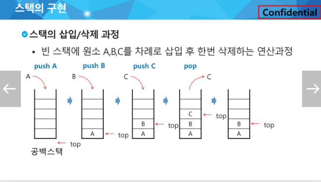
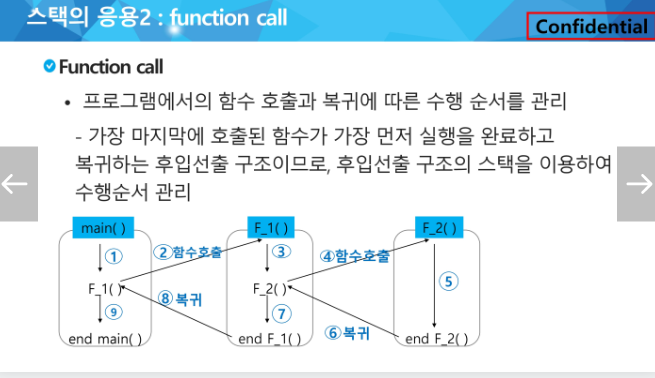
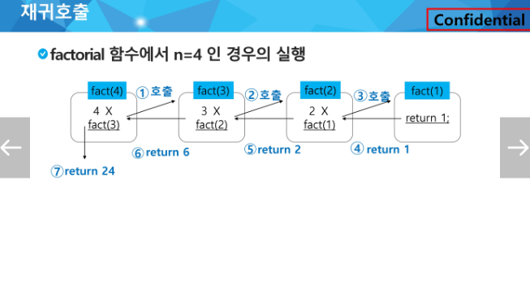
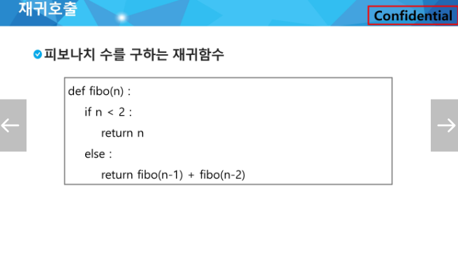
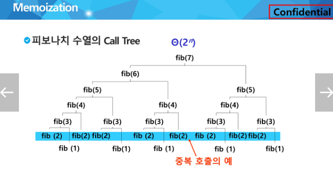
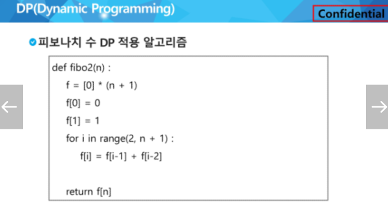

# STACK1
# 1. 스택 자료구조의 개념과 기본 연산

### 1) 스택 자료구조의 개념
1. 스택의 자료구조
    - 물건을 **쌓아 올리듯** 자료를 쌓아 올린 형태의 자료구조
    - 스택에 저장된 자료는 선형 구조이다
    - 스택에 자료를 **삽입 하거나** 스택에서 자료를 **꺼낼 수 있다**


2. 스택의 특성
    - 마지막에 삽립한 자료를 가장 먼저 꺼낸다
    - **후입선출(LIFO, Last-In-First-Out)**
    - 예를 들어 스택에 1,2,3 순으로 자료를 삽입한 후 꺼내면 역순으로 즉 3,2,1 순으로 꺼낼 수 있다
    - 배열을 사용할 수 있다
    - 스택에 마지막 삽입된 원소의 위치를 **top**이라고 부른다


### 2) 스택 자료구조의 기본 연산
- 삽입 : 저장소(stack)에 자료를 저장한다. (push라고 부른다)
- 삭제 : 저장소(stack)에서 자료를 꺼낸다. (보통 stack.pop()으로 삭제를 하며 stack의 마지막으로 저장된 자료가 삭제된다)
- isEmpty : 스택이 공백인지 아닌지를 확인하는 연산
- peek : 스택의 top에 있는 item(원소)을 반환하는 연산


# 2. 스택을 응용한 괄호 검사 알고리즘과 함수 호출과 재귀 호출
### 1) 스택을 응용한 괄호 검사 알고리즘
```python
'''
3
print('{} {}'.format(1, 2))
N, M = map(int, input().split())
print('#{} {}'.format(tc, find())
'''

T = int(input())
for tc in range(1, T + 1):
    _ = list(input())
    parenthesis = ['{', '(', ')', '}']
    arr = []
    for char in _:
        if char in parenthesis:
            arr.append(char)
    stack = []
    top = -1
    result = 0  # 기본 결과 출력값을 0 으로 초기화(성공하는 조건이면 1로 재할당 할것이고, 아니라면 이대로 0을 출력할거임)
    for idx in range(len(arr)):
 
        if top == -1:  # 스택이 비어있는경우
            if arr[idx] == '{' or arr[idx] == '(':  # 스택의 처음은 무조건 여는 괄호만 들어올 수 있음
                stack.append(arr[idx])
                top += 1
            elif arr[idx] == '}' or arr[idx] == ')':
                top += 1
                break
        else:  # top이 -1이 아닌경우(즉, 처음이 아닌경우)
            if arr[idx] == '{' or arr[idx] == '(':  # 여는 괄호는 언제든 계속 들어갈수있음
                stack.append(arr[idx])
                top += 1
 
            elif arr[idx] == '}' and stack[-1] == '{':  # 닫는괄호는 stack에 마지막이 같은 모양의 여는괄호일때만 알맞는 쌍을 이룬다
                stack.pop()  # 그 경우 stack 안에 들어있는 같은 모양의 괄호를 지워줌
                top -= 1
 
            elif arr[idx] == ')' and stack[-1] == '(':  # 위와 같은 원리로 동작
                stack.pop()
                top -= 1
 
            elif arr[idx] == '}' and stack[-1] == '(':
                stack.append(arr[idx])
                top += 1
 
            elif arr[idx] == ')' and stack[-1] == '{':
                stack.append(arr[idx])
                top += 1
    # 위에 명시된 조건으로 반복문이 돌아갔다면 쌍이 맞는 괄호들은 전부 pop이 되었을거임.
    # 그렇다면 stack은 비어있어야하고 top은 -1이 되어야 함.
    else:
        if top == -1:  # 따라서 만약 top이 -1 이면 괄호검사에 통과했으므로 result를 1로 재할당 해준다.
            result = 1
        else:
            result = 0
    print(f'#{tc} {result}')
```
### 2) 스택을 응용한 함수 호출


### 3) 스택을 응용한 재귀 호출
- 재귀호출의 특징
    1. 필요한 함수가 자신과 같은 경우 자신을 다시 호출하는 구조
    2. 재귀호출방식을 함수로 만들면 프로그램의 크기를 줄이도 간단하게 작성   
    ex) factorial, 피보나치 수열 

  

# 3. 메모이제이션
### 메모이제이션의 사용배경
- 재귀함수로 구현한 알고리즘에는 많은 중복 호출이 존재한다는 문제점이있다. 


### 메모이제이션이란
- 메모이제이션은 이전에 계산한 값을 메모리에 저장해서 매번 다시 계산하지 않도록 하여 전체적인 실행 속도를 빠르게 하는 기술이다.
- 동적 계획법의 핵심이 되는 기술이다.
### 재귀함수를 활용한 피보나치 수열 & 메모이제이션을 활용한 피보나치 수열
```python
# 메모이제이션을 사용하지 않은 순수 재귀 함수
def fibonacci_recursive(n):
    if n <= 1:
        return n
    return fibonacci_recursive(n-1) + fibonacci_recursive(n-2)

# 테스트
print(fibonacci_recursive(10))  # 55
```
```python
# 메모이제이션을 활용한 재귀 함수
def fibonacci_memoization(n, memo={}):
    if n in memo:  # 이미 계산된 값이 있다면 반환
        return memo[n]
    if n <= 1:  # 기본 케이스
        return n
    # 계산하고 메모이제이션 테이블에 저장
    memo[n] = fibonacci_memoization(n-1, memo) + fibonacci_memoization(n-2, memo)
    return memo[n]

# 테스트
print(fibonacci_memoization(10))  # 55
```
# 4. 동적계획(DP) 알고리즘 개념
- DP알고리즘은 그리디 알고리즘과 같이 최적화 문제를 해결하는 알고리즘이다.
- DP알고리즘은 먼저 입력 크기가 작은 부분 문제들을 모두 해결한 후에 그 해들을 이용하여 보다 큰 크기의 부분 문제들을 해결하여, 최종적으로 원래 주어진 입력의 문제를 해결하는 알고리즘이다.  


# 5. 스택을 이용한 깊이 우선 탐색(DFS) 알고리즘
- 시작 정점에서 정해진 방향에 따라 갈 수 있는 경로가 있는 곳까지 탐색하다가, 더이상 갈곳이없으면 가장 마지막 갈림길로 되돌아가 다른 방량의 정점으로 탐색을 반복하여 최종적으론 모든 정점을 방문하는 순회 방법이다.
- 가장 마지막에 만났던 갈림길의 정점으로 돌아간다는 점에서 후입선출 구조의 stack이 사용되는 대표적인 예시이다.
### DFS 코드
```python
'''
7 8
1 2 1 3 2 4 2 5 4 6 5 6 6 7 3 7

'''

# stack 풀이
# 정점의 개수, 간선의 개수
V, E = map(int, input().split())

# 간선 정보
data = list(map(int, input().split()))
# print(data)  # [1, 2, 1, 3, 2, 4, 2, 5, 4, 6, 5, 6, 6, 7, 3, 7]


def DFS(start):
    stack = [start]  # 시작 지점
    visited = [0] * (V + 1)  # 방문 여부를 체크하는 리스트

    # True인 동안 돈다. (==> False 일때까지 돈다.)
    while stack:  # 스택에 값이 있는 동안 반복 (스택이 빌때까지 반복)
        current = stack.pop()  # 현재 조사할 노드

        # 방문했는지 안했는지 (방문하지 않은 노드라면)
        if visited[current] == 0:
            visited[current] = 1  # 방문 표기
            print(current, end= ' ')  # 방문한 노드 출력

            # 현재 노드에서 갈 수 있는 다음 노드들을 찾아야 함 (찾아서 스택에 넣어야 함)
            for next in range(V, 0, -1):
                # 다음 노드들 중에 
                # 1. 현재 노드와 간선으로 연결되어 있는지
                # 2. 방문한 적이 없는지
                if matrix[current][next] == 1 and visited[next] == 0:
                    stack.append(next)


# 인접행렬 생성
# 빈 도화지 만들기
matrix = [[0] * (V + 1) for _ in range(V + 1)]
# pprint(matrix)

for i in range(E):
    n1 = data[i * 2]
    n2 = data[i * 2 + 1]
    matrix[n1][n2] = 1
    matrix[n2][n1] = 1
# pprint(matrix)

DFS(1)

```